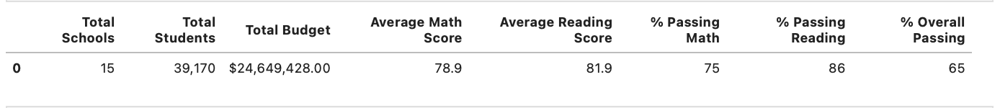
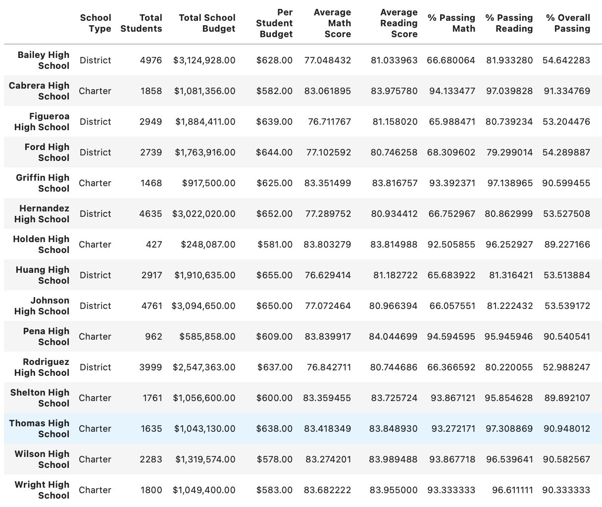
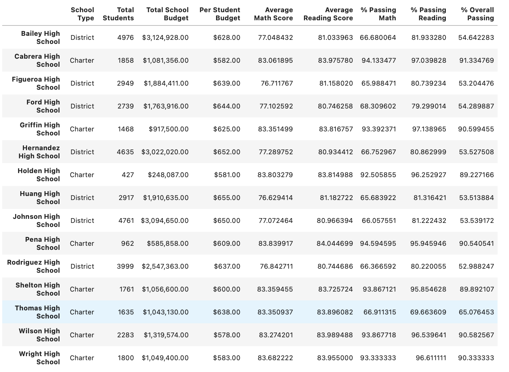
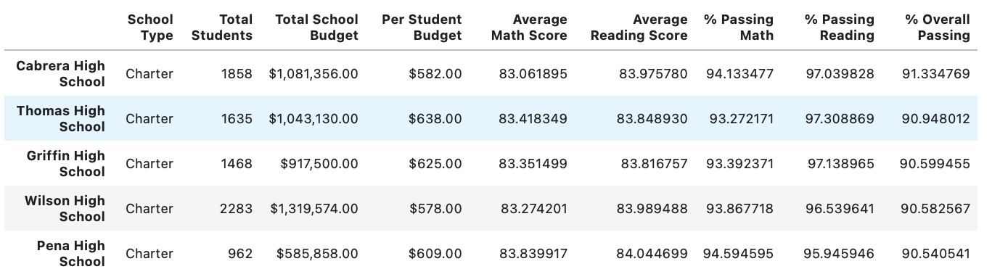
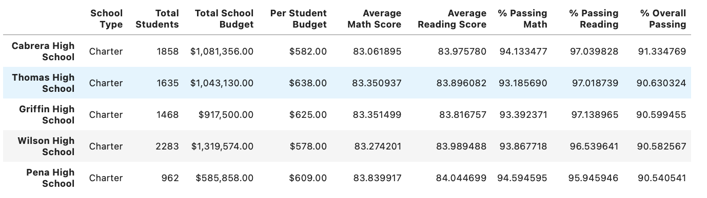
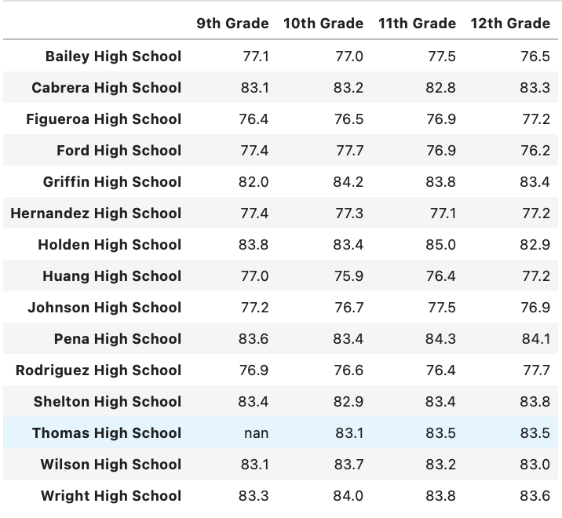
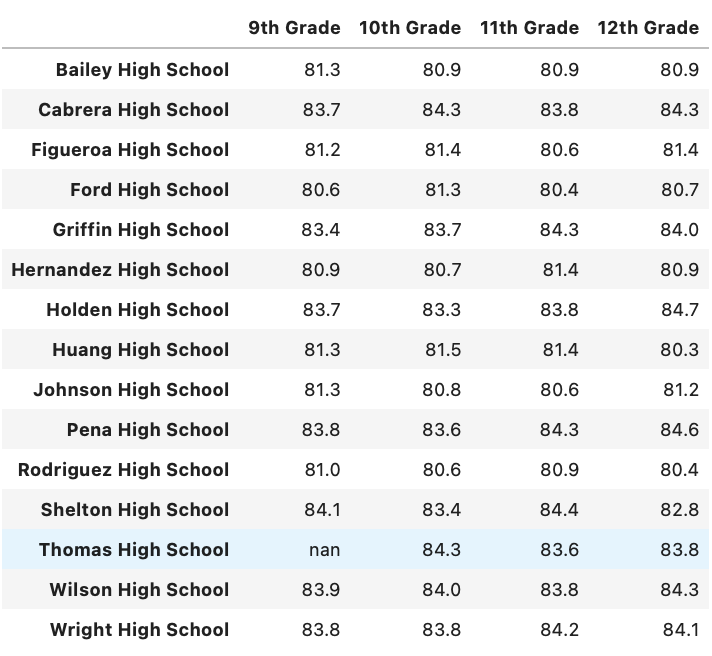
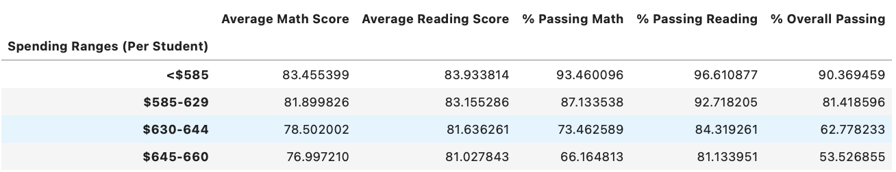
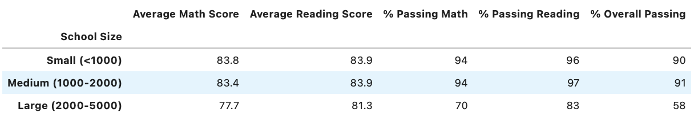
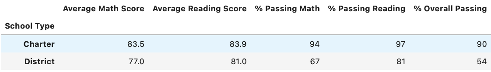

# School_District_Analysis

## Overview Of School District Analysis

The school board has been notified of the nonethical adjustment of academic scores (math and reading) for students in the ninth grade attending Thomas High School. The school board has requested that an analysis be performed in the effort to uphold the testing standards for the state. The school board has requested to replace the math and reading scores for Thomas High School with NaNs while keeping the rest of the data intact then perform an analysis on the school district. The objective is to compare this revised analysis of the district to the original analysis that was performed prior to the removal the scores (ninth grade) from Thomas High School.

## Results

* How is the district summary affected?
	* Overall, the summary for the performance of the district is unaffected by the removing the effect that Thomas High School's ninth grade performance would have. Neither of the key metrics measuring the performance of the district changed.

	

* How is the school summary affected?
	* If the school summary wasn't adjusted for Thomas High School, the passing percentages would have brought Thomas High School from being a top tier performer down to a bottom tier school by keeping the ninth grade scores that are under investigation as a null value (first screenshot below).

	
	Before removing Thomas High School Ninth grade scores

	* In the following sections, removing the effect of Thomas High School's ninth grade scores shows that there is no impact to the overall analysis as is also suggested in the revised school summary (second screenshot below).

	
	After removing Thomas High School Ninth grade scores
	
* How does replacing the ninth graders’ math and reading scores affect Thomas High School’s performance, relative to the other schools?
	* Whether using the original analysis before the Thomas High School ninth grade scores were suspected of dishonesty or the analysis that removes those score altogether, Thomas High School's metrics that include only grade levels 10-12 keep them as a top 5 passing percentage school.

	
	Original Top 5 Overall Passing Percentage

	
	Original Top 5 Overall Passing Percentage

* How does replacing the ninth grade scores affect the following:

	* The average scores for math and reading for the remaining grade levels (10-12) are consistently high in comparison to other schools and have nearly no variation when comparing average scores across each individual grade level for Thomas High School.

	  	* Math and Reading Scores by Grade

		

		

	* The following methods of performance measuring techniques have no change when removing the effect of the ninth grade scores from Thomas High School students:

  		* Scores by School Spending

		

  		* Scores by School Size

		

  		* Scores by School Type

		

## Summary of Analysis

In the results above, we have five instances where removing the Thomas High School ninth grade scores have no impact on the metrics being measured (district summary, school summary, and scores by school spending/size/type). That said, the we see in the math and reading scores by grade level that Thomas High School has nearly the same scores for each grade level. If it's found that there was academic dishonesty being applied when the ninth grade scores from Thomas High School were being recorded, the driver may have been due to the ninth grade scores being materially below than the 10th, 11th, and 12 grade scores which are nearly identical when compared side-by-side. If that is the case, then the metrics above will certainly be affected which would lower the performance of Thomas High School and reduce it's attractiveness when compared to other charter schools.

